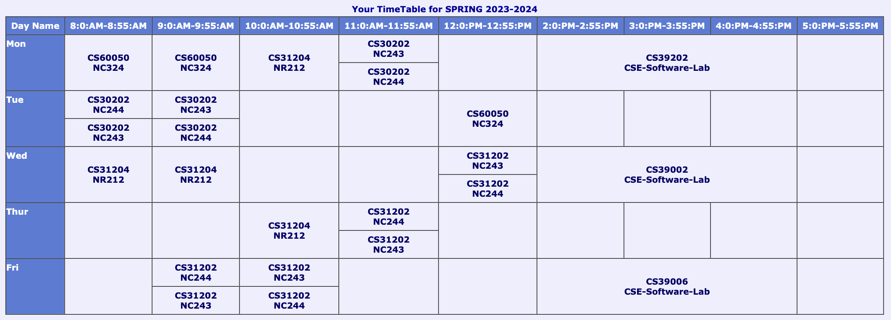

# 6TH-SEMESTER-CSE

[Website](https://garggopal2001.github.io/cse_material/#sem06)

## Previous Lectures

[DATABASE MANAGEMENT SYSTEMS](https://www.youtube.com/playlist?list=PLO11h2zbAVtN6vg7nkn_HZrVLVIbn6GfD)

<!-- [DATABASE MANAGEMENT SYSTEMS LABORATORY]() -->

[MACHINE LEARNING](https://www.youtube.com/playlist?list=PLO11h2zbAVtOlC0QUteMgYRl3hvrkgfuc)  | [ML-AUTUMN](https://youtube.com/playlist?list=PLO11h2zbAVtNG0TaFG7hbcug3GEb5qWJr)

[COMPUTER NETWORKS - 1](https://www.youtube.com/playlist?list=PLO11h2zbAVtN3Z2lQH4CpM_vaKFr41oGI) | [COMPUTER NETWORKS - 2](https://www.youtube.com/playlist?list=PLO11h2zbAVtNtPW9Myt9otRVQHmuM4nh8)

[NETWORKS LAB - 1](https://www.youtube.com/playlist?list=PLO11h2zbAVtONEcGM1qFbn7vDfkCDn59z) | [NETWORKS LAB - 2](https://www.youtube.com/playlist?list=PLO11h2zbAVtNlAzWcvxlchgnDWCKeIwMo)

[OPERATING SYSTEMS - 1](https://www.youtube.com/playlist?list=PLjSFIV2WJbpyz756lW-vKWjzi9VXgSTT1) | [OPERATING SYSTEMS - 2](https://www.youtube.com/playlist?list=PLO11h2zbAVtNMv72nvIy1sHnyIHgnN1cx)

[OPERATING SYSTEMS LABORATORY](https://www.youtube.com/playlist?list=PLUfABYNel-fiBufnqvcTo6OxPoAaDC9v7)

## Notes

[Running Notes](https://iitkgpacin-my.sharepoint.com/personal/mondalbratin2003_kgpian_iitkgp_ac_in/_layouts/15/onedrive.aspx?login_hint=mondalbratin2003%40kgpian%2Eiitkgp%2Eac%2Ein&id=%2Fpersonal%2Fmondalbratin2003%5Fkgpian%5Fiitkgp%5Fac%5Fin%2FDocuments%2FSTUDY%20NOTES%2FSEMESTER%2FLECTURE%20NOTES&view=0)

